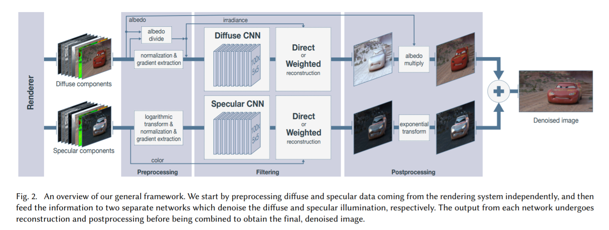
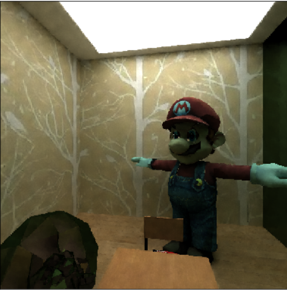

## Kernel-Predicting Convolutional Networks for Denoising Monte Carlo Renderings

### Overview
On the machine learning side of denoising, we adopt the paper with the network architecture above to denoise. Particularly, the diffuse and specular components are trained to denoise separately before they are combined together to reconstruct the original image. We adopt the KPCN mode of the network, which means we will yield a kernel for denoising the input images. This is proven by the authors to converge 5-6x faster than directly yielding denoised images.

### Input Components

For both the diffuse component inputs and the specular ones, the inputs to the network consist of the following channel:
* diffuse/specular image (32 spp), gradients in both directions, variance
* gradients of depth in both directions
* gradients of normal in both directions
* gradients of albedo in both directions
* ground truth diffuse/specular image (550 spp)

The diffuse components are preprocessed by dividing by the albedo to only keep the illumination map, while the specular components go through logarithmic transform to reduce the range of pixel values for more stable training.

### Training

Both subnetworks consist of 9 Convolutional layers, optimized by ADAM optimizer with a batch-size of 16, learning rate of 1e-4 for specular network and 1e-5 for diffuse network. We train for 10 epochs in total.

| Noisy Input - 32 spp | Denoised - 32 spp | Ground Truth - 550 spp |
| - | - | - |
|  |  |  |

