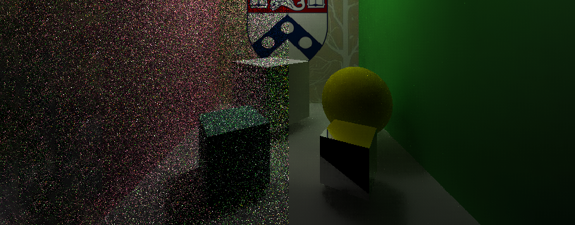
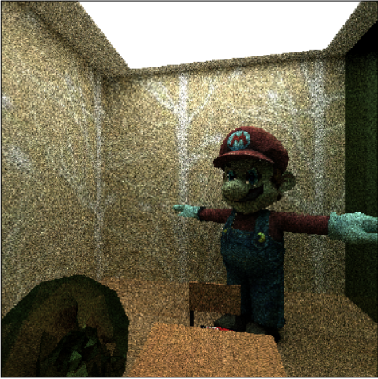
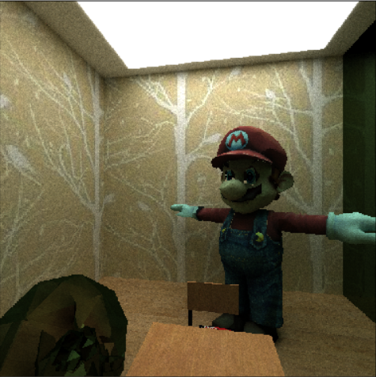
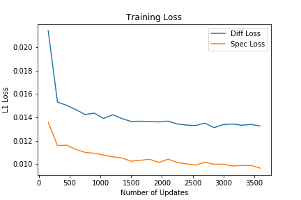

CUDA SVGF
================


## Overview
Physically based monte-carlo path tracing can produce photo-realistc rendering of computer graphics scenes. However, even with today's hardware it is impossible to converge a scene quickly and meet the performance requirement for real-time interactive application such as games. To bring path tracing to real-time, we reduce sample counts per pixel to 1 and apply post-processing to eliminate noise.

*Signal processing* and *Accumulation* are two major techniques of denosing. Signal processing techniques blur out noise by applying spatial filters or machine learning to the output; Accumulation techniques make it possible to reuse samples in a moving scene by associating pixel between frames. *Spatio-Temporal Variance Guided Filter* [Schied 2017] combines these two techniques and enables high quaility real-time path tracing for dynamic scenes.

## SVGF Pipeline


### Path Tracing
The project is developed based on [CIS 565 CUDA Path Tracer](https://github.com/ZheyuanXie/Project3-CUDA-Path-Tracer).

### Temporal Accumulation
To reuse samples from the previous frame, we reproject each pixel sample to its prior frame and calculate its screen space coordinate. This is completed in the following steps:
1. Find world space position of the current frame in G-buffer.
2. Transform from current world space to the previous clip space using the stored camera view matrix.
3. Transform from previous clip space to previous screen space using perspective projection.

For each reprojected sample we test its consistency by comparing current and previous G-buffer data (normals, positions, object IDs). If the test rejects, we discard the color and moment history of the corresponding pixel and set history length to zero.

### Spatial Filtering
The spatial filtering is accomplished by a-trous wavelet transform. As illustrated in the figure below, the a-trous wavelet transfrom hierarchically filters over multiple iterations with increasing kernel size but a constant number of non-zero elements. By inserting zeros between non-zero kernel weights, computational time does not increase quadratically.


A set of edge stopping functions prevent the filter from overblurring important details. Three edge-stopping functions based on position, normal, and luminance are used as in *Edge-avoiding À-Trous wavelet transform for fast global illumination filtering*  [Dammertz et al. 2010]. The standard deviation term in luminance edge-stopping function is based on variance estimation. This will guide the filter to blur more in regions with more uncertainty, i.e. large variance.

## Performance

## Build Instruction
 1. Clone this repository.
 ```
 $ git clone https://github.com/ZheyuanXie/CUDA-Path-Tracer-Denoising
 $ cd CUDA-Path-Tracer-Denoising
 ```
 2. Create a build folder.
 ```
 $ mkdir build && cd build
 ```
 3. Run CMake GUI.
 ```
 $ cmake-gui ..
 ```
 4. Configure the project in `Visual Studio 2017` and `x64`, then click Generate.
 5. Open Visual Studio project and build in release mode.

## Kernel-Predicting Convolutional Networks for Denoising Monte Carlo Renderings


### Overview
On the machine learning side of denoising, we adopt the paper with the network architecture above to denoise. Particularly, the diffuse and specular components are trained to denoise separately before they are combined together to reconstruct the original image. We adopt the KPCN mode of the network, which means we will yield a kernel for denoising the input images. This is proven by the authors to converge 5-6x faster than directly yielding denoised images.

### Input Components

For both the diffuse component inputs and the specular ones, the inputs to the network consist of the following channel:
* diffuse/specular image (32 spp), gradients in both directions, variance
* gradients of depth in both directions
* gradients of normal in both directions
* gradients of albedo in both directions
* ground truth diffuse/specular image (550 spp)

The diffuse components are preprocessed by dividing by the albedo to only keep the illumination map, while the specular components go through logarithmic transform to reduce the range of pixel values for more stable training.


### Training

Both subnetworks consist of 9 Convolutional layers, optimized by ADAM optimizer with a batch-size of 16, learning rate of 1e-4 for specular network and 1e-5 for diffuse network. We train for 10 epochs in total.

| noisy input - 32spp | denoised - 32spp | GT - 550spp |
| - | - | - |
|  |  |  |





## Team
 - Zheyuan Xie
 - Yan Dong
 - Weiqi Chen

## Acknowledgments
 - [1] [Spatiotemporal Variance-Guided Filtering: Real-Time Reconstruction for Path-Traced Global Illumination](https://research.nvidia.com/publication/2017-07_Spatiotemporal-Variance-Guided-Filtering%3A): This is the primary paper the project is based on.
 - [2] [Edge-avoiding À-Trous wavelet transform for fast global illumination filtering](https://dl.acm.org/citation.cfm?id=1921491): This paper with its code sample also helped a lot in the spatial filtering part.
 - [3] [Alain Galvan's Blog](https://alain.xyz/blog/raytracing-denoising): Alain's blog posts, as well as his Nov. 20 lecture talk at UPenn gave us a good overview and understanding of denosing technoligies.
 - [4] [Dear ImGui](https://github.com/ocornut/imgui): This library enable us to create GUI overlay with ease.
